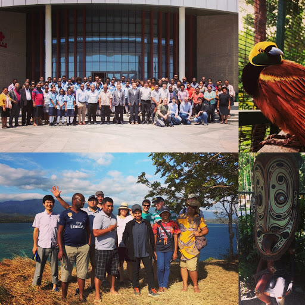
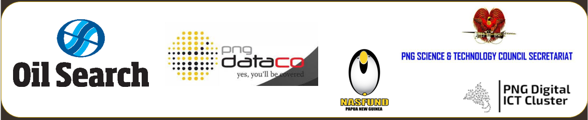

**First International Workshop on BRIdging the Divides with Globally Engineered Software (BRIDGES2019)**

### 12th - 14th Sept. 2019

## About
The objective of the International Workshop on BRIdging Divides with Globally Engineered Software (BRIDGES) is to foster development by providing a forum where researchers and practitioners can report on and discuss issues and solutions to bridge the digital divide of information within a practical geographic-free global software engineering setting.

The workshop encourages the exchange of ideas within the local and international community with its ultimate goal to make software engineering universal; for anyone, anywhere, without any technical, cultural and educational boundaries. This involves a round-table discussion with invited talks from both local and international participants.

## International Participants
- [President/Professor Yokoya, NAIST Japan](http://www.naist.jp/en/about_naist/president/profile.html) 
- [Prof. Marco Aurelio Gerosa, Northen Arizona University, USA](https://www.ime.usp.br/~gerosa/) 
- [Prof. Igor Steinmacher, Northen Arizona University, USA](https://nau.edu/school-of-informatics-computing-and-cyber-systems/faculty/igor-steinmacher/) 
- [Prof. Sebastian Baltes, University of Adelaide Australia](https://empirical-software.engineering/) 
- [Prof. Raula Gaikovina Kula, NAIST Japan](https://raux.github.io/)
- [Prof. Christoph Treude, University of Adelaide Australia](http://ctreude.ca/)
- [Prof. Hideaki Hata, NAIST Japan](https://hideakihata.github.io/)
- Prof. Kenichi Matsumoto, NAIST Japan
- Mr. Goro Watanabe, NAIST Japan

## Local Participation
- University of Papua New Guinea
- Papua New Guinea Science and Technology Secretariat
- Papua New Guinea Digital Cluster
- National High Schools
- PNG ICT Specialists

## Organizers 
- Raula Gaikovina Kula (Organizer, Nara Institute of Science and Technology)
- Christoph Treude (Organizer, University of Adelaide)
- Hideaki Hata (Organizer, Nara Institute of Science and Technology)
- John Genolagani (Local, University of Papua New Guinea)
- William Tapio (Local, University of Papua New Guinea)
- Sharon Torao-Pingi (Local, University of Papua New Guinea)

Due to limited space availability, DAY2 and DAY3 attendance at the workshop is by invitation only.

## Venue
BRIDGES2019 will take place at the International Conference Center (Day 1) and Motupore Island Research Center (Day 3), which is located on an island off the coast of Port Moresby, capital of Pacific nation, Papua New Guinea (PNG). Known as the land of unexpected, locals speak over 850 languages and have a diverse culture, flora and fauna (like the Bird of Paradise and the world's largest butterfly, the Queen Alexandra Birdwing), making PNG one of the last untouched locations on the planet. With independence day looming on September 16th, we expect the area to be buzzing with pacific-style culture and experiences. 

## Overview of Program
**DAY 1 - International Conference Center (ICC).**

Session | Details
-------------- | -------------
8:00 - 9:00 | Registration
-------------- | ---------------
9:00 - 10:00 | Welcome
Welcome Address | UPNG Vice Chancellor - Prof. Frank G. Griffin, PhD
Welcome Statement | NAIST President - Prof. Naokazu Yokoya, PhD
Theme BRIDGES2019 | Organizing - Prof. Raula Gaikovina Kula
------------ | -------------
10:00 - 10:30 | Break (Group Photo)
------------ | -------------
10:30 - 12:30 | Welcome
Industry Talk | PNG DataCo Ltd - Mr. Paul Komboi, MD 
Industry Talk | Kina Bank Ltd - Ms Lena Korugl
PNG Government | National Science & Technology Council - Prof Teatulohi Matainaho, CEO
------------ | -------------
12:30 - 1:30 | LUNCH 
------------ | -------------
1:30 - 3:00 | International SE Talks I
------------ | -------------
.. |  Designing appropriate chatbots for tourism and software development (Prof. Marco Aurelio Gerosa)
.. |  Diversity and Social Aspects of Open Source Software Communities (Prof. Igor Steinmacher)
------------ | -------------
3:00 - 3:30 | Break 
------------ | -------------
3:30 - 4:30 | International SE Talks II 
------------ | -------------
.. |  Software Developers' Work Habits and Expertise (Prof. Sebastian Baltes)
.. |  Panel Discussion (How is SE unique to PNG?)
------------ | -------------
4:30 - 5:00 | Day 1 Wrap-up and Networking
------------ | -------------

**DAY 2 - Motupore Island Research Center: Conference Room.**

Session | Details
------------ | -------------
morning (9.30am - 10:30am)| Recap discussions from Day 1 for Day 3.

**DAY 3 - Motupore Island Research Center: Conference Room.**

Session | Details
------------ | -------------
morning (9.30am - 12:00pm)| Breakout groups to discuss unique challenges for software engineering students, educators, and industry in Papua New Guinea
afternoon (2:00pm - 4.30pm) | Breakout groups to discuss potential solutions to the challenges
wrap-up (5:00pm - 5.30pm) | Wrap-up and plans for the next instance of BRIDGES

## International Talks

**Designing appropriate chatbots for tourism and software development**

Abstract: Chatbots promote new forms of human-computer interaction; however, user satisfaction is frequently low. The investigation of social aspects is often neglected, even though people expect chatbots to reflect social and conversational protocols. For instance, little is known about how to conform chatbots’ utterances to their social role in an interactional situation. The sole use of standard sentences frequently leads to communication breakdowns and violates users’ expectations. In this research, we are investigating how to conceive and evaluate a linguistic-based approach for enriching chatbots’ utterances. We will build a corpus of conversation logs of tourists interacting with tour guides, analyze this corpus to identify registers, adapt chatbot utterances to those specific registers, and evaluate the extent to which this strategy achieves register-specific language functions, meets users’ expectations, and coheres with the expected social role of a tour guide. Moreover, we are investigating how GitHub projects use bots and chatbots in order to design an appropriate bot for reviewing pull-requests.

Marco Gerosa’s research lies in the intersection between Software Engineering and Social Computing, focusing on the fields of empirical software engineering, mining software repositories, software evolution, and social dimensions of software development. He receives productivity fellowship from the Brazilian Council for Scientific and Technological Development. In addition to his research, he also coordinates award-winning open source projects.

**Diversity and social aspects of open source software communities**

Abstract: The web, your desktop, smartphones, your car: almost everything high-tech depends on open source these days. Interestingly, open source is more than a technical environment, it is an open collaboration endeavor in which developers from all over the globe work together towards developing high-quality software products. In such an environment, sustainability and long-term success are usually related to having a diverse and welcoming environment. In this talk, I will talk about how the community works in terms of governance, and discuss onboarding and diversity in open source communities.

Igor Steinmacher obtained a Ph.D. in Computer Science at the University of São Paulo in 2015. Currently, he is an Assistant Professor at the School of Informatics, Computing and Cyber Systems at Northern Arizona University. He has been studying Open Source Communities for 10 years, with special focus on supporting newcomers onboarding to Open Source projects. His research interests include Human Aspects of Open Source Software Communities, Diversity in Software Engineering, Mining Software Repositories, and Social Network Analysis.  

**Software Developers' Work Habits and Expertise**

Abstract: Analyzing and understanding software developers' work habits and resulting needs is an essential prerequisite to improve software development practice. This talk outlines how we utilized different qualitative and quantitative research methods to empirically investigate three underexplored aspects of software development: First, we describe how software developers use sketches and diagrams in their daily work and derive requirements for better tool support. Then, we explore to what degree developers copy code from the popular online platform Stack Overflow without adhering to license requirements and motivate why this behavior may lead to legal issues for affected open source software projects. Finally, we present a novel theory of software development expertise and identify factors fostering or hindering the formation of such expertise.

Sebastian Baltes is a Lecturer in the School of Computer Science at the University of Adelaide, Australia. He received his PhD degree in Computer Science from the University of Trier, Germany. In his research, he empirically analyses software developers' work habits to identify requirements for new tools and point to possible tool and process improvements. For him, thoroughly analysing and understanding the state-of-practice is an essential first step towards improving how software is being developed. Too often, decisions are still rather opinion-based than data-informed. His long-term goal is to bridge the gap between empirical research and practice, both by studying relevant phenomena and by communicating the results back to practitioners.

## Travel
To get to Port Moresby, the national airline, Air Niugini, operate weekly direct flights from the capital city to many domestic and international destinations including Singapore, Tokyo, Sydney, Brisbane, Cairns, Manila and Hong Kong. A visa is required to visit PNG, though passport holders from many countries are eligible for a 60-day visa on arrival for free at Port Moresby airport. 

<iframe src="https://www.google.com/maps/embed?pb=!1m18!1m12!1m3!1d125932.71912184669!2d147.1544731256938!3d-9.474114003519416!2m3!1f0!2f0!3f0!3m2!1i1024!2i768!4f13.1!3m3!1m2!1s0x69024a74e29ae88d%3A0x69e6ee3ec6e02d7b!2sMotupore+Island!5e0!3m2!1sen!2sjp!4v1555982574073!5m2!1sen!2sjp" width="400" height="450" frameborder="0" style="border:0" allowfullscreen></iframe>

Papua New Guinea used to be lesser-known to the world, but now it's rapidly opening up to more intrepid travelers with its unique topography and enchanting natural scenery.  

## Supporters

Our event is proudly sponsored by Oil Search, PNG DataCo, PNG Science and Technology Council Secretariat, Nasfund Papua New Guinea and PNG Digital ICT Cluster.

   
  

